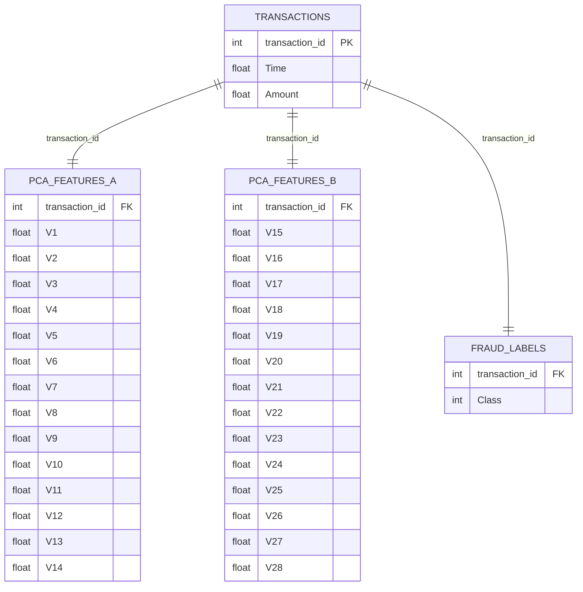

# DS 4320 Project 1: Minimizing False Positives in Credit Card Fraud Detection

Executive summary: ⭐

Jia Park

cqb3tc

DOI: 

Press Release: https://myuva-my.sharepoint.com/:t:/g/personal/cqb3tc_virginia_edu/IQCnFZzNFqqNQb0UtI-_0r9pAc1-qGJMkEiwJCKgjRGC6-k?e=fpCNea

Data: https://myuva-my.sharepoint.com/:f:/g/personal/cqb3tc_virginia_edu/IgDP25kYkhXAToyIUUZcS3tuARwprBDZEEW4XlIUfnmt56o?e=KWiiKT

Pipeline: https://myuva-my.sharepoint.com/:f:/g/personal/cqb3tc_virginia_edu/IgAcHPDgzsxqRqNWI00vOzwuAbosDCi01mVACKLiaT1bilk?e=LKCDlc

License: ⭐

## Problem Definition

Initial general problem: Detecting credit card fraud

Refined problem statement: How can credit card fraud detection models be improved to reduce false positives (legitimate transactions incorrectly flagged as fraudulent) while still accurately identifying actual fraud?
  
Rationale: Most fraud detection research focuses on catching as much fraud as possible, but this often comes at the cost of flagging too many legitimate transactions. In practice, this creates a frustrating problem for both banks and customers who expect their transactions to go through without interruption. By narrowing the focus to false positive reduction specifically, the project targets something meaningful that simple existing models tend to overlook.

Motivation: Credit card fraud affects millions of people every year and costs the financial industry billions of dollars annually. While catching fraud is clearly important, overly aggressive detection systems create their own set of problems, including declined purchases, locked accounts, and frustrated customers. This project was motivated by the idea that a strong fraud detection system should not only catch fraud accurately but also avoid unnecessarily disrupting the everyday transactions of legitimate customers.

Press Release: Smarter Fraud Detection: Catching criminals without punishing customers
- https://myuva-my.sharepoint.com/:t:/g/personal/cqb3tc_virginia_edu/IQCnFZzNFqqNQb0UtI-_0r9pAc1-qGJMkEiwJCKgjRGC6-k?e=XJztNo

## Domain Exposition
Terminology:
|---|
Credit Card Fraud: Unauthorized use of a credit card to make purchases or withdraw funds.
|---|
Fraud Detection System: A system that monitors financial transactions and identifies suspicious or fraudulent activity.
|---|
False Positive: A legitimate transaction that is incorrectly flagged as fraudulent.
|---|
Transaction: A financial activity such as a purchase, withdrawal, or transfer made using a credit card.

Domain: This project belongs to the domain of financial technology (FinTech) and machine learning–based fraud detection. Financial institutions process millions of credit card transactions every day, making it impossible to manually monitor each one for fraudulent activity. As a result, banks and payment companies rely on automated fraud detection systems that analyze transaction data and identify suspicious patterns. These systems often use machine learning models trained on historical transaction data to predict whether a transaction is fraudulent.

Background reading folder: https://myuva-my.sharepoint.com/:f:/g/personal/cqb3tc_virginia_edu/IgCNfrvNnv7RTqshIpOKvqMNATQwMfeQ6U5zlT_hMIvaz6o?e=SoGWmS

Table:
| Title | Description | Link |
|-------|-------------|------|
| False Positives in Credit Card Fraud Detection: Measurement and Mitigation | Proposes a new method for assessing the cost of false positives and evaluates several state-of-the-art fraud detection classifiers using this method. | [Link](https://myuva-my.sharepoint.com/:b:/g/personal/cqb3tc_virginia_edu/IQAINZ3zbyM2S4wY_2zdqDnTAaegpeUyhl1truLWT_7n7ks) |
| The Hidden Cost of Fraud: An Instance-Dependent Cost-Sensitive Approach for Positive and Unlabeled Learning | Introduces a novel technique that integrates PU learning and instance-dependent cost-sensitive framework to directly minimize financial loss from fraud. | [Link](https://myuva-my.sharepoint.com/:b:/g/personal/cqb3tc_virginia_edu/IQD_Xr-KkDfaSoo8wO3jKM9XAeErWJZTzXG3EFMv2qP4Knk?e=efxjDw) |
| Solving the False Positives Problem in Fraud Prediction Using Automated Feature Engineering | Presents an automated feature engineering based approach to dramatically reduce false positives in fraud prediction. | [Link](https://myuva-my.sharepoint.com/:b:/g/personal/cqb3tc_virginia_edu/IQBaaJMgZOzxR4Opg3pIR2kCARkYXB2gY6csKX_3GkLaBdw) |
| Reduce Card Fraud and Costs While Improving the Cardholder Experience | A visual article describing the negative effects of false positives upon users and how to mitigate them. | [Link](https://myuva-my.sharepoint.com/:b:/g/personal/cqb3tc_virginia_edu/IQDW_QiezwzZRJa0plV0q8_4AdKrUvlncIrfCCX1nIqqdUg?e=22LRxe) |
| Reducing False Positives in Credit Card Fraud Detection Through Cost Sensitive Learning Models | Explores the application of cost-sensitive learning models to effectively reduce false positives while maintaining high fraud detection accuracy. | [Link](https://myuva-my.sharepoint.com/:b:/g/personal/cqb3tc_virginia_edu/IQDAdIXW4rweQZCXMTgf3N5_AVoMXICif5CTbSJYmxljAb0?e=KfyyYs) |

## Data Creation

Provenance: The raw data used in this project was sourced from Kaggle, a public data science platform. The dataset contains 284,807 credit card transactions made by European cardholders over two days in September 2013, of which 492 are fraudulent. Due to confidentiality constraints, the original transaction features were transformed using Principal Component Analysis (PCA), resulting in 28 anonymized numerical components labeled V1 through V28. The only untransformed features are Time, which records the seconds elapsed since the first transaction, and Amount, which records the transaction value. A binary Class label indicates whether each transaction is fraudulent.
  To prepare the data for relational storage and modeling, the original flat file was split into four CSV tables linked by a transaction ID: a transactions table containing Time and Amount, two PCA feature tables splitting V1 through V28, and a fraud labels table containing the Class variable. SMOTE was then applied to the training portion of the data to address the severe class imbalance, where fraudulent transactions account for only 0.172% of all records.

Code: 
| File | Description | Link |
|------|-------------|------|
| data_creation.ipynb | Loads the raw Kaggle dataset, splits it into four relational CSV tables linked by transaction ID, and applies SMOTE to address class imbalance in the training data | [Link](https://github.com/jpwrk/DS4320_project1/blob/main/data_creation.ipynb) |

Bias Identification: Since the four relational tables were created by splitting a single Kaggle dataset, any bias present in the original data carries over into the constructed dataset. The original data only covers two days of transactions from European cardholders in 2013, so the dataset does not represent a diverse population of cardholders or time periods. Additionally, the uncertainty regarding the features means that there may be some further feature manipulation that we did not do. Because the features have been anonymized through PCA, it is impossible to audit whether the original data collection process introduced any demographic or geographic bias.

Bias Mitigation: SMOTE was applied only to the training portion of the constructed dataset to synthetically balance the fraud and legitimate transaction classes. This directly addresses the class imbalance bias introduced by the original data collection process. Also, keeping the test set untouched by SMOTE ensures that model evaluation reflects the true real world distribution of transactions rather than an artificially balanced one. This is also less relevant but the data was split in a way that is realistic to the real-world settings of data, with positive and negative classes being seperate.

Rationale: Time and Amount were kept together in the transactions table since they are the only real world observable features. The PCA components were split evenly across two tables since there was no meaningful way to separate anonymous features by content. The fraud labels were isolated into their own table because in a real banking system, labels would be maintained separately from raw transaction data by fraud investigators. A transaction ID was engineered from the row index to serve as the primary key linking all four tables together.

## Metadata
Schema: 

Data:
| Table | Description | Link |
|-------|-------------|------|
| transactions | Contains the transaction ID, time elapsed since first transaction, and transaction amount for each record | [Link](https://myuva-my.sharepoint.com/:x:/g/personal/cqb3tc_virginia_edu/IQCvcxg8CNlpTZVRtyZGCFqEAX6CpTuM1ofjmUuNBusKTVw?e=apaRp7) |
| pca_features_a | Contains the first 14 anonymized PCA components (V1-V14) linked to each transaction | [Link](https://myuva-my.sharepoint.com/:x:/g/personal/cqb3tc_virginia_edu/IQCkG9tOfiXMT5D-yfbyBSThARNAY20h9UWQ-YLHUzuGltw?e=uu7xS0) |
| pca_features_b | Contains the remaining 14 anonymized PCA components (V15-V28) linked to each transaction | [Link](https://myuva-my.sharepoint.com/:x:/g/personal/cqb3tc_virginia_edu/IQC6QmzJuDtPQIqK9LYjsDNdAZf2gZaAdcw6xr0L8B5Dm8Q?e=Du52Lr) |
| fraud_labels | Contains the binary fraud label for each transaction, where 1 indicates fraud and 0 indicates legitimate | [Link](https://myuva-my.sharepoint.com/:x:/g/personal/cqb3tc_virginia_edu/IQCvcxg8CNlpTZVRtyZGCFqEAX6CpTuM1ofjmUuNBusKTVw?e=i7klA3) |

Data Dictionary: 
| Name | Data Type | Description | Example |
|------|-----------|-------------|---------|
| transaction_id | int | Unique identifier for each transaction, engineered from row index | 10042 |
| Time | float | Seconds elapsed between this transaction and the first transaction in the dataset | 406.0 |
| Amount | float | The monetary value of the transaction in Euros | 149.62 |
| V1 | float | First principal component from PCA transformation of original features | -1.3598 |
| V2 | float | Second principal component from PCA transformation of original features | -0.0728 |
| V3 | float | Third principal component from PCA transformation of original features | 2.5363 |
| V4 | float | Fourth principal component from PCA transformation of original features | 1.3782 |
| V5 | float | Fifth principal component from PCA transformation of original features | -0.3383 |
| V6 | float | Sixth principal component from PCA transformation of original features | 0.4624 |
| V7 | float | Seventh principal component from PCA transformation of original features | 0.2396 |
| V8 | float | Eighth principal component from PCA transformation of original features | 0.0987 |
| V9 | float | Ninth principal component from PCA transformation of original features | 0.3638 |
| V10 | float | Tenth principal component from PCA transformation of original features | 0.0908 |
| V11 | float | Eleventh principal component from PCA transformation of original features | -0.5516 |
| V12 | float | Twelfth principal component from PCA transformation of original features | -0.6178 |
| V13 | float | Thirteenth principal component from PCA transformation of original features | -0.9913 |
| V14 | float | Fourteenth principal component from PCA transformation of original features | -0.3111 |
| V15 | float | Fifteenth principal component from PCA transformation of original features | 1.4682 |
| V16 | float | Sixteenth principal component from PCA transformation of original features | -0.4704 |
| V17 | float | Seventeenth principal component from PCA transformation of original features | 0.2079 |
| V18 | float | Eighteenth principal component from PCA transformation of original features | 0.0258 |
| V19 | float | Nineteenth principal component from PCA transformation of original features | 0.4039 |
| V20 | float | Twentieth principal component from PCA transformation of original features | 0.2514 |
| V21 | float | Twenty-first principal component from PCA transformation of original features | -0.0183 |
| V22 | float | Twenty-second principal component from PCA transformation of original features | 0.2778 |
| V23 | float | Twenty-third principal component from PCA transformation of original features | -0.1105 |
| V24 | float | Twenty-fourth principal component from PCA transformation of original features | 0.0669 |
| V25 | float | Twenty-fifth principal component from PCA transformation of original features | 0.1285 |
| V26 | float | Twenty-sixth principal component from PCA transformation of original features | -0.1891 |
| V27 | float | Twenty-seventh principal component from PCA transformation of original features | 0.1336 |
| V28 | float | Twenty-eighth principal component from PCA transformation of original features | -0.0211 |
| Class | int | Binary fraud label where 1 indicates a fraudulent transaction and 0 indicates legitimate | 0 |

Quanitification of Uncertainty:
| Name | Uncertainty |
|------|-------------|
| Time | 94813.86 ± 47488.15 |
| Amount | 88.35 ± 250.12 |
| V1 | 0.00 ± 1.959 |
| V2 | 0.00 ± 1.651 |
| V3 | 0.00 ± 1.516 |
| V4 | 0.00 ± 1.416 |
| V5 | 0.00 ± 1.380 |
| V6 | 0.00 ± 1.332 |
| V7 | 0.00 ± 1.237 |
| V8 | 0.00 ± 1.194 |
| V9 | 0.00 ± 1.099 |
| V10 | 0.00 ± 1.089 |
| V11 | 0.00 ± 1.021 |
| V12 | 0.00 ± 0.999 |
| V13 | 0.00 ± 0.995 |
| V14 | 0.00 ± 0.959 |
| V15 | 0.00 ± 0.915 |
| V16 | 0.00 ± 0.876 |
| V17 | 0.00 ± 0.849 |
| V18 | 0.00 ± 0.838 |
| V19 | 0.00 ± 0.814 |
| V20 | 0.00 ± 0.771 |
| V21 | 0.00 ± 0.735 |
| V22 | 0.00 ± 0.726 |
| V23 | 0.00 ± 0.624 |
| V24 | 0.00 ± 0.606 |
| V25 | 0.00 ± 0.521 |
| V26 | 0.00 ± 0.482 |
| V27 | 0.00 ± 0.404 |
| V28 | 0.00 ± 0.330 |

